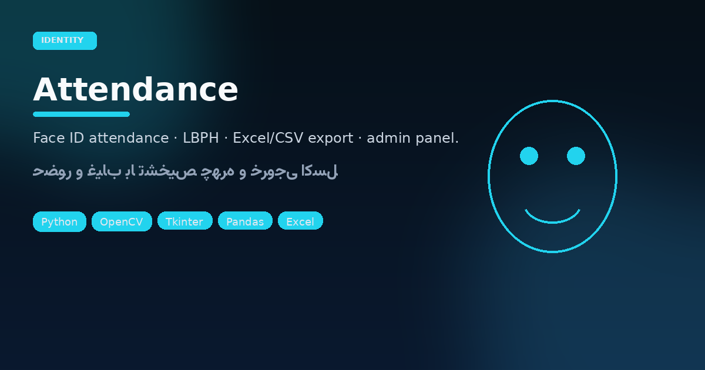

<p align="center"></p>

# Attendance System · yasin Face ID

<p align="center">


</p>

<p align="center"><strong>Identity desk for small teams</strong> — register faces, scan to clock in, export sheets.</p>

## Security-minded overview

| Layer | Behavior |
|-------|----------|
| Capture | Webcam via OpenCV Haar cascade |
| Model | `LBPHFaceRecognizer` trained on Desktop `Attendance_Data` |
| Logs | `attendance_db.csv` (+ active logs folder) |
| Admin | Password-gated panel for reviews / export |

UI theme: navy / cyan (“YASIN FALLAHATI” header). Persian labels throughout.

### Run

```bash
pip install opencv-python opencv-contrib-python pandas numpy pillow
python3 "Attendance system.py"
```

> Paths assume Windows `USERPROFILE` Desktop folders in the current script — adjust if you deploy on Linux.

---

## فارسی — سیستم حضور و غیاب چهره

نسخهٔ دسکتاپ **تشخیص چهره** برای ثبت ورود: ثبت‌نام کاربر جدید (نام فارسی/انگلیسی)، اسکن دوربین، آموزش مدل LBPH، و خروجی CSV/Excel. پنل مدیریت با رمز برای بازبینی لاگ‌ها.

### جریان کار

1. **ثبت‌نام** — چند فریم چهره ذخیره می‌شود  
2. **شروع اسکن** — تطبیق با مدل و ثبت ساعت/تاریخ  
3. **مدیریت** — مشاهده و خروجی گرفتن از فایل‌ها  

### تکنولوژی‌ها

`OpenCV` · `opencv-contrib` (LBPH) · `Pandas` · `Pillow` · `Tkinter`

مناسب آموزشگاه، دفتر کوچک، یا دموی هویت‌سنجی آفلاین — بدون ارسال تصویر به کلود.
